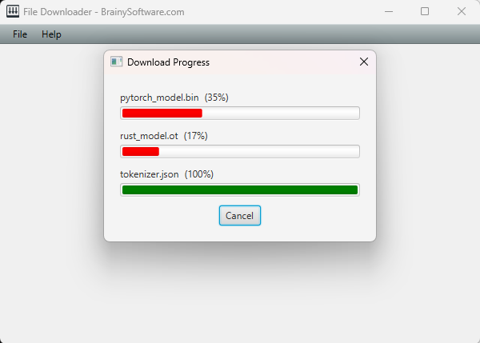

# javafx-filedownloader

An open-source JavaFX component for downloading multiple files concurrently using 
[Java HttpClient API](https://download.java.net/java/early_access/jdk26/docs/api/java.net.http/java/net/http/HttpClient.html).

## Prerequisite:
- Java 11 or later (this project was tested with Java 23)
- Maven 3.9 or later
- Knowledge of Maven directory structure

## Testing the Downloader Class
Run the sample.DownloaderTest class in src/test.

## Running the JavaFX Example
The example is located under the example package. To run it, open a command prompt or a terminal and type the following:

- mvn javafx:run

## Improvement?
The writing time looks negligible compared to download time.
